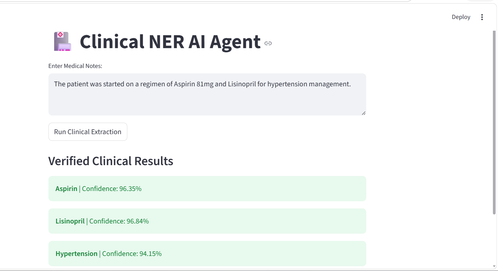
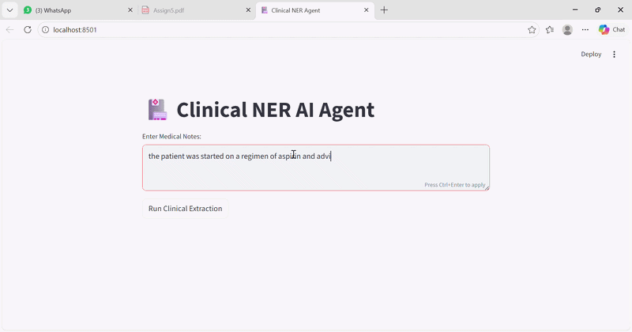

# Clinical NER System

A professional Named Entity Recognition (NER) agent designed to extract drugs and medical conditions from clinical text. The system utilizes a fine-tuned RoBERTa transformer model with a high-performance FastAPI backend and a Streamlit user interface.

## System Architecture
* **Backend**: FastAPI REST API handling model inference and data validation.
* **Frontend**: Streamlit dashboard for real-time entity visualization.
* **Processing Logic**: Implements sub-word token merging and a 60% confidence threshold to ensure clinical accuracy.

## Project Demo



## Installation & Setup

1. **Clone and Setup Environment**:
   ```bash
   git clone <your-repository-link>
   cd Clinical-NER
   python -m venv venv
   .\venv\Scripts\activate
   pip install -r requirements.txt
   ```

2. **Launch Backend (The Brain)**:
   In a new terminal:
   ```bash
   uvicorn src.main:app --reload
   ```

3. **Launch Frontend (The Face)**:
   In a second terminal:
   ```bash
   python -m streamlit run src/app.py
   ```

## Key Features
* **Threshold Gate**: Automatically filters out any entities with a confidence score below 60%.
* **Clinical Filtering**: Integrated blacklist to remove common non-medical noise (e.g., "Patient," "Hospital").
* **Entity Merging**: Handles complex chemical nomenclature by merging sub-word tokens into single entities.

## Technical Stack
* **Language**: Python 3.13
* **AI Frameworks**: PyTorch, Hugging Face Transformers
* **API Framework**: FastAPI / Uvicorn
* **UI Framework**: Streamlit
